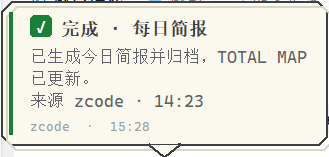
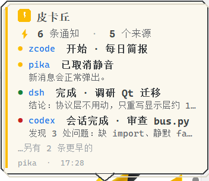

# ⚡ 皮卡丘：一个统一的通知用桌宠


本地通知总线 + 桌宠气泡 + 健康提醒。三块互相独立、可单独使用，只通过一条
消息协议（`pikapet.protocol.Notification`）通信。

- **总线**：监听 `127.0.0.1:7452` 的消息总线（7452 = PIKA 的手机九键
  键序，刻意挑的冷门端口防撞车）。任何软件 POST 一条 JSON 进来，
  桌宠就弹气泡。不轮询，推送靠 SSE 长连接。
- **桌宠**：桌面桌宠（tkinter，仅 Windows）。只负责"显示"：透明置顶小窗口、
  气泡、拖动、右键菜单、隐藏到角落。不感知消息来源。
- **健康提醒**：提醒调度器。纯逻辑、平台无关，Windows 空闲检测作为
  注入的 ActivitySource 实现。定时随机提醒（默认每 1~2 小时）+ 久坐提醒
  （连续工作超阈值）。
- **zcode 适配器**：ZCode 自动化 → 总线的适配器，一行命令发通知。
- **codex 适配器**：Codex → 总线的适配器。`event` 子命令处理
  `agent-turn-complete` 事件 JSON（notify/hooks 均可接），弹「这轮问了什么 +
  回答开头」；`report` 子命令与 zcode 适配器同构，供 Codex automations 汇报。
- **dsh 适配器**：DSH headless 子任务包装器。`run` 把 `dsh --profile
  headless` 包在中间全程汇报（「开始 · 任务」带任务摘要 → 「完成 · 任务」带回答
  摘要或「失败 · 任务」带 stderr 尾部），stdout 原样透传，可无脑替换直接调
  dsh；`report` 子命令手动汇报。
- **统一标题语法**：所有适配器的气泡标题都是「{事件词} · {名称}」——会话完成
  类（zcode Stop 钩子、codex turn-complete）为「会话完成 · 标题」，阶段类为
  「开始/进行中/完成/失败 · 名称」；标题不放 emoji，级别语义由气泡徽章与
  配色表达，来源显示在 meta 行。

Python 包名是 `pikapet`（PyPI 上 `pika` 是 RabbitMQ 客户端，会撞名），
命令行入口叫 `pikachu`。

## 快速开始

装一次，然后在任何目录都能用：

```bash
pipx install .        # 或 pip install -e . 做开发
pikachu pet           # 启动桌宠（内嵌总线 + 内嵌健康提醒，一条命令全起来）
pikachu send "你好" "我是皮卡丘，你写代码超过一小时了"
pikachu zcode "每日简报" --stage done --detail "生成 3 个文件"
pikachu doctor        # 环境自检
```

不想装也行，在仓库根目录用 `python -m pikapet <子命令>`，或
`python pikachu.py <子命令>`——三条路走的都是同一个 `pikapet.cli:main`，
参数与行为完全一致。

桌宠默认**内嵌健康提醒**（后台线程跑调度循环，配置同 `reminder.json`），
`--no-reminder` 可关。独立 runner 仍保留给"只跑总线不跑桌宠"的场景。

依赖：Python 3.9+，tkinter（桌宠）、Pillow（贴图透明处理，可选）。全部标准库
实现总线与提醒，无需 pip 安装任何东西。

## 运行时数据在哪

token、端口协商文件、桌宠状态、日志都在 `%LOCALAPPDATA%\pikachu\`
（其他平台走 XDG 的 `~/.local/share/pikachu`），**不在源码目录**——否则
装到 site-packages 后会往包目录写文件，多份 checkout 还会各持一套 token
互相连不上。`PIKACHU_HOME` 可覆盖（测试与多实例并存都靠它）。

| 文件 | 用途 |
|---|---|
| `token` | 投递鉴权密钥，首次启动生成 |
| `port` | 端口回退时的实际端口，供发送方协商 |
| `pet_state.json` | 桌宠缩放 / 气泡缩放 / 静音 / 窗口位置 |
| `pikachu.log` | 滚动日志（`PIKACHU_LOG_LEVEL` 调级别，默认 WARNING） |
| `hook_stdin.log` | ZCode 钩子收到的原始 stdin，供排查 |

老版本把这些写在仓库的 `runtime/` 下；桌宠或总线启动时会把其中的 `token`
与 `pet_state.json` 自动搬到新位置（不覆盖已有的），偏好不丢。

### 偏好记忆

桌宠大小、气泡大小、静音、窗口位置都记在 `pet_state.json`，下次启动原样
恢复。落盘有三条时机：改动的入口即时存（滚轮/菜单缩放、静音开关、拖动
结束）、每 5 秒兜底自动存（内容没变就不写盘）、正常退出时再存一次。

自动存这一道是因为前两条盖不住"被强杀"：任务管理器结束进程、注销、断电
都走不到退出保存那条路，改了半天的大小和位置就白改了。

缩放会顺带挪窗口（保持视觉中心、并钳回屏幕内），所以缩放时位置也一起
存——只存缩放的话，下次启动会用上一次拖动时的旧坐标，皮卡丘"自己跳一下"。
恢复时坐标同样钳回屏幕内：换了显示器或改了分辨率后旧坐标可能落在屏幕外，
那样皮卡丘就再也点不到了。

## 消息协议

任何软件（不限 Python）向总线 POST（必须 `Content-Type: application/json`，
并携带 `X-Pika-Token` 头——值在运行时目录的 `token`，首次启动自动生成）：

```bash
curl -X POST http://127.0.0.1:7452/notify \
  -H "Content-Type: application/json" \
  -H "X-Pika-Token: $(cat "$LOCALAPPDATA/pikachu/token")" \
  -d '{"title":"该休息了","body":"起来走走","level":"warn","source":"reminder","ttl":10}'
```

token 鉴权说明：CLI / 适配器 / 钩子等**己方工具自动附带** token，用户无感；
未携带或携带错误 token 的 POST 返回 403。它挡的是本机其他进程的误投和
端口撞车，不是同用户恶意进程的防线（后者读得到 token 文件）。GET 类
端点（health/history/SSE）不鉴权，只读无害。

| 字段 | 必填 | 说明 |
|---|---|---|
| `title` | 是 | 气泡标题 |
| `body` | 否 | 补充说明，可换行 |
| `level` | 否 | `info` / `success` / `warn` / `error` |
| `source` | 否 | 来源标识（用于去重和统计） |
| `ttl` | 否 | 自动消失秒数；`0` = 常驻直到点击 |
| `ts` | 否 | epoch 秒，不填由总线补齐 |

可靠性设计：
- 桌宠挂 SSE 长连接实时收消息，**不轮询**；
- 断线重连自动带 `?after=<mid>` 增量补拉，只补错过的消息，不重放旧消息；
- 总线重启（跨进程 pid 变化或同进程重建的 generation 代次变化）后客户端自动
  重置增量游标，全量补拉；历史消息（超过 60 秒的旧消息）只计数不弹泡；
- SSE 连接建立时服务端立即发送带内身份行 `: gen=<代次> pid=<进程号>`，客户端
  发现身份与已知不同就断开、清游标、无游标重连全量补拉——即使总线在客户端
  健康探测的间隙完成重启（旧游标会把该补送的消息过滤掉），也不会丢消息；
- 总线进程被意外 kill 时，客户端在心跳超时（默认 20 秒）内检测到并自动重连；
- 慢订阅者不阻塞发布方：队列满的连接会被断开，由客户端重连补拉；
- 本机端口被其他软件占用时，桌宠内嵌总线自动回退到随机端口，并把实际端口
  写入运行时目录的 `port`，同时打印提示；
- **端口协商**：所有发送方（CLI / 适配器 / 钩子）连不上目标端口时，自动读
  `port` 文件用桌宠的实际端口重试一次——即使发生了端口回退，通知链
  也不会断。

**不做静默 fallback**。这类"看起来在跑其实全断了"的状态比直接报错难查得多，
所以以下情况一律显式失败并留痕，而不是悄悄降级：

- token 写不进盘 → 抛 `TokenError`（否则总线持内存 token、发送方读不到文件，
  表现是所有投递 403）；
- `port` 文件内容被写坏 → 抛 `PortFileError`（否则"消息发不出去"完全没线索）；
- `?after=` / `?n=` 参数非法 → 返回 400（`after` 尤其危险：静默当成"无游标"
  会让客户端以为在增量补拉、实际收到全量回放，重复弹一屏气泡）；
- 发送方读不到 token → 记 WARNING 说明总线会 403，不再默默发裸请求；
- 桌宠状态文件损坏 → 仍回退默认值（不该挡住启动），但一定记 WARNING。

界面层那些"失败也得继续"的地方（贴图重绘、气泡定位、30fps 跟随 tick）走
`pikapet.logs.swallow`：异常照旧不外传，但带 traceback 记一条；高频路径用
`once=True` 首次记 WARNING、之后降 DEBUG，既不刷屏也不真静默。
调 `PIKACHU_LOG_LEVEL=DEBUG` 能看到全部细节。

## 模块与命令

```text
pikachu pet          # 桌宠（--subscribe-only 订阅外部总线，--no-reminder 关提醒）
pikachu bus          # 独立总线（默认 7452）
pikachu reminder     # 健康提醒（独立跑；桌宠已内嵌，通常不用）
pikachu send ...     # 命令行发通知
pikachu history      # 查看最近消息
pikachu health       # 查看总线状态
pikachu doctor       # 环境自检
pikachu zcode <名称> --stage done --detail "说明"
pikachu codex event '<JSON>'          # Codex turn-complete 事件
pikachu dsh run "任务名" "任务文本"    # 包装 DSH 子任务
```

三个适配器另有独立入口（`pikachu-zcode` / `pikachu-codex` / `pikachu-dsh`），
钩子和自动化配置里写死命令时更短，与对应子命令完全等价。没装包时把
`pikachu` 换成 `python -m pikapet` 即可。

## 健康提醒配置

编辑 `pikapet/configs/reminder.json`（`reminder` 子命令会自动发现；`--config` 可指定）：

```json
{
  "interval_enabled": true,
  "interval_min": 60,
  "interval_max": 120,
  "categories": ["eye", "neck", "water", "stand", "screen", "walk", "posture"],
  "long_session_enabled": true,
  "long_session_min": 90,
  "rest_min": 5,
  "long_categories": ["stand", "neck"],
  "title": "该休息一下了"
}
```

- `interval` 通道：每 `interval_min`~`interval_max` 分钟内的随机时刻提醒一次
  （人空闲超过 30 分钟则顺延，不打扰）；
- `long_session` 通道：连续工作（键盘/鼠标空闲未达 `rest_min` 分钟）累计超过
  `long_session_min` 分钟提醒一次，发完重置计时，直到出现一次足够长的休息
  才重新武装。

内置七类文案（`categories` 可自由增删）：`eye` 看远处护眼、`neck` 活动脖子、
`water` 喝水、`stand` 站起来走走、`screen` 离屏幕远一点、`walk` 出门散步、
`posture` 坐姿检查；久坐长休息从 `long_categories` 里取。每类多条文案按权重
随机轮换，不会连续重复同一句。

文案在 `pikapet/reminder_phrases.py`，分类 + 权重，加文案不用改代码。

## ZCode 集成

### 会话完成气泡（已接通）

`~/.zcode/cli/config.json` 注册了 `Stop` 钩子（`hooks.enabled: true`）：
每次回复完成，ZCode 以 process 方式调用 `tools/zcode_hook.py`，弹气泡
「会话完成 · <会话标题>」——标题按 stdin 字段 → 客户端会话库
`~/.zcode/cli/db/db.sqlite` 的 `session.title`（只读查询，与界面显示一致）
→ 转录首条用户消息 → 目录名兜底；正文是最后一条回复的开头 120 字符。
钩子永远 exit 0、总线不在时不影响会话（失败会记一条 WARNING 到日志，
不再完全静默）；原始 stdin 落在运行时目录的 `hook_stdin.log` 供排查。
测试见 `tests/test_zcode_hook.py`。

### 自动化的开始/结束汇报（提示词约定）

钩子事件里没有自动化专用信号，自动化的"开始/结束"靠在自动化提示词里
写两行 CLI 调用（结束时 Stop 钩子也会再报一次会话完成）：

```bash
pikachu zcode "每日简报" --stage start
pikachu zcode "每日简报" --stage done --detail "生成 3 个文件"
pikachu zcode "watch-inbox" --stage error --detail "权限不足"
```

`--stage` 决定标题事件词与配色：`start`(开始 · info) / `done`(完成 · success) /
`error`(失败 · error) / `run`(进行中 · info)。
创建自动化时把第一行放进任务开头、第二/三行按结果放在结尾即可。

## Codex 集成

Codex 每轮回复完成会发出事件，两套接入方式的事件名不一样，适配器都认：

- **notify**：事件类型是 `agent-turn-complete`，配在 `~/.codex/config.toml`；
- **hooks**（Codex 0.147+）：事件名走 `hook_event_name`，取 `Stop` /
  `SubagentStop`。负载形状不同（没有 `type`、没有 `input_messages`），
  所以标题退到工作目录名，正文为空时再退到 `transcript_path` 尾部的
  最后一条回复。

### notify 只有一个槽位，用分发器共享

`notify` 是单程序槽。本机那个槽已经被 computer-use 占了，直接改成皮卡丘会
把 computer-use 弄坏，所以走 `tools/codex_notify_dispatch.py` 分发：

```text
Codex ──notify──> 分发器 ──┬─> 原来的 computer-use（参数原样透传）
                           └─> 皮卡丘适配器（弹气泡）
```

```toml
# ~/.codex/config.toml
notify = [ "C:\\path\\to\\pythonw.exe",
           "D:\\_Project\\pikachu\\tools\\codex_notify_dispatch.py" ]
```

下游程序默认取 computer-use 的常规安装路径，可用
`PIKACHU_CODEX_NOTIFY_DOWNSTREAM` 覆盖（设为空字符串表示"只通知皮卡丘、
不转发"），它的固定参数用 `PIKACHU_CODEX_NOTIFY_DOWNSTREAM_ARGS`。

分发器对 Codex 的承诺是**永远 exit 0**：先转发原有功能（它优先级更高），
再通知桌宠；下游崩了、路径不存在、负载不是 JSON、总线没起——统统只记日志，
不让 Codex 卡住或报错。用 `pythonw.exe` 而不是 `python.exe` 是为了每轮结束
时不闪一下控制台窗口。

hooks 那条路也能用（事件 JSON 走 stdin），但它在 Codex 0.147 里还是实验
特性：要在 `features` 里打开、且首次使用需要过一次信任确认，`codex exec`
非交互模式下实测不触发。notify 这条路开箱即用，所以本机用的是它。

```bash
pikachu codex event '{"type":"agent-turn-complete","input_messages":["审查代码"],"last_assistant_message":"发现 3 处问题……"}'
echo '<JSON>' | pikachu-codex event   # 也可从 stdin 读
pikachu codex report "每日简报" --stage done --detail "生成 3 个文件"
```

事件模式下总线不在也返回 0（通知钩子绝不能阻塞 Codex）；非"一轮结束"的
事件（`PreToolUse` 等）安静忽略。测试见 `tests/test_adapter_codex.py` 与
`tests/test_codex_notify_dispatch.py`。

## DSH 集成

DSH 是一次性 headless agent（无钩子系统），适配器做**包装运行**——替代直接
调 `dsh`，全程汇报且行为透明（stdout = 最终回答，退出码透传）：

```bash
pikachu dsh run "调研X" "任务文本……" --cwd D:\scratch --timeout 420
# 超长任务文本（Windows 命令行 ~32K 上限）写文件传入：
pikachu dsh run "调研X" --task-file /tmp/dsh-task.md --cwd D:\scratch
# 手动汇报某个阶段（与 zcode 适配器同构）：
pikachu dsh report "调研X" --stage done --detail "结论：……"
```

生命周期气泡：「开始 · 任务名」（带任务摘要）→「完成 · 任务名」（带回答开头）
或「失败 · 任务名」（带退出码 + stderr 尾部）；超时返回 124，找不到 dsh 返回 4。
测试见 `tests/test_adapter_dsh.py`（用桩可执行文件，不依赖真实 dsh）。

## 桌宠交互



- **悬浮显示状态气泡**：结构化排版，一眼看清有几项、哪几项、每项讲什么。

  

  顶部一行汇总（总条数 + 来源数，数字加粗墨色）；下面每条占一到两行：
  级别色圆点 + 蓝色来源名 + 墨色加粗标题，第二行缩进放一行灰色摘要。
  条目一律**截断不折行**——每条固定占一行，眼睛才能沿左边缘数出有几项；
  超出的条目不悄悄丢掉，末尾写「…另有 N 条更早的」。同来源同内容的重复
  消息在展示层合成一条（总数仍按真实收到的算）。
  颜色只承载语义：圆点表级别、来源名用强调蓝、标题墨色、摘要灰、数字加粗，
  正文本身不整体上色。
- 通知气泡：有 `ttl` 自动消失；悬浮其上不消失；点击立即关闭；
- 气泡外观：Canvas 手绘的**像素风切角卡片**，致敬 pilog（pixel / minimal 主题）——
  纸白底 `#FBF8EE` + 2px 墨色硬边框 + 无模糊的偏移硬阴影，左侧强调色条 + 方形徽章
  （info 皮卡丘黄⚡手绘闪电 / success 绿✓ / warn 橙! / error 红✕），等宽字体
  （Cascadia Code）分级排版（标题加粗、正文、来源·时间小字），中文自动回退雅黑，
  文本按像素宽折行、超宽自动换行，位置钳回屏幕内，底边小尾巴正对皮卡丘脑袋；
  **正文支持 Markdown 子集**：标题（#/##/###）、粗体、斜体、行内代码、无序/有序
  列表、引用、分隔线、链接（`[文字](url)` 点击会打开浏览器），由 `pikapet/mdflush.py`
  纯标准库渲染，零依赖；
- **缩放**：鼠标滚轮或右键菜单可放大/缩小**桌宠**（像素素材按 NEAREST 重渲染，
  放大不糊、保持算法像素味）；右键菜单还可单独放大/缩小**气泡**——字号、内距、
  尾巴、折行宽度同步缩放，**状态气泡的信息量也跟着变**：放大到 1.6 以上显示
  6 条并带摘要，缩到 0.8 以下只留 2 条标题。缩放调的是"显示多少内容"，
  不只是把字变大（阈值见 `pikapet.pet.STATUS_BUDGET`）；
- 右键菜单：自绘像素风切角卡片（纸白面 + 硬边 + 硬阴影 + 悬停反色），含
  显示状态 / 立即提醒一次（从真实文案池取，不影响自动提醒的节奏）/
  静音（按当前状态显示"静音"或"取消静音"）/
  放大缩小桌宠 / 放大缩小气泡 /
  隐藏到角落 / 关于 / 退出；点击菜单外任意处、按 Esc、或失焦即自动关闭；
- **跟随移动**：拖动皮卡丘时，气泡中心始终贴着皮卡丘脑袋（尾巴正对脑袋），
  随皮卡丘同步移动、缩放后同样重定位；开着的右键菜单也跟随皮卡丘挪动；
- 静音：消息照常记录与去重，但不弹气泡；
- 隐藏后：屏幕右下角出现 ⚡ 标签，点一下唤回；
- **鼠标跟随**：皮卡丘会连续转身看向鼠标（~30fps）。素材只有朝左的转身，
  朝右为镜像帧；换边永远经过正面帧，不会出现镜像瞬移。资产缺失时自动
  回退静态贴图。

## 转身帧资产（重新生成）

`assets/turn/{left,right}/NN.png` 由 `tools/build_turn_assets.py` 从视频一次性
生成：解码 → 边界连通域抠黑底（阈值 24：背景纯黑、身体黑斑因压缩带亮度，
转身时耳尖暗部不会误连背景）→ 形态学去噪（删孤岛/按亮度填洞——误抠的黑斑
填回原色，纯黑的尾巴缝隙保持透明/腐蚀压缩暗边）→ 全序列统一裁剪 → 左右耳尖
定身体对称轴并居中合成（换边时身体逐像素重合，只有尾巴左右跳；缩放强制奇数宽
保住该性质）→ 预乘 alpha BOX 缩放（高度优先；面积平均的 alpha 让细耳尖不随
子像素相位闪烁）→ 滞回双阈值二值化定稿 → 相邻帧自适应补中间帧（剪影重合度
≥0.90 才补，大位移区段不补以免重影）。坡道砍掉了只会动嘴的 f002-f012（鼠标
小幅移动就能进入明显转身段），跳过眨眼帧 f015-f017（避免鼠标停在对应角度时
永久闭眼）。混合补帧只用于运动中（动态模糊），桌宠静止时按 manifest 的
`blend_indices` 吸附到最近的真实关键帧，画面永远清晰。改参数后重建：

```bash
python tools/build_turn_assets.py   # 需 PIL + scipy（如 numpy/ndimage）
```

源视频 `assets/pikachu_turn_v4.mp4`（和中间产物 `pikachu_raw.png`）是构建
输入、不进仓库——运行只需要生成好的 `assets/turn/`。要重建就把源视频放回
该路径再跑上面的命令。


## 架构

```text
zcode 适配器 ─┐
codex 适配器 ─┤
dsh 适配器 ───┼─► 总线（HTTP + SSE）─► 桌宠（显示端）
其他软件 ─────┤
健康提醒 ─────┘
```

依赖方向只有一种：发送方 → 总线 → 显示端。发送方不需要知道桌宠是否存在；
桌宠不需要知道消息从哪来。Windows 专用代码只存在于 `pikapet/pet.py` 和
`pikapet/win/idle.py`，其余模块可跨平台运行。

这条边界是语言无关的：想换个显示端（Qt / Rust / C#），只要订阅 SSE 并按
协议解析 JSON 就行，总线与适配器一行都不用改。

## 测试

```bash
python -m unittest discover -s tests -v   # 单元测试
python tests/e2e/run_all.py               # 端到端测试（起真进程）
ruff check .                              # 静态检查
```

单元测试 310 个，端到端 17 项。端到端覆盖：总线 CLI 往返、桌宠进程内嵌总线收发、
提醒器→总线→桌宠全链路、SSE 心跳保活、跨进程总线重启恢复、GUI 悬浮绑定、
转身朝向决策（滞回/平滑/经过正面换边）等。

测试全部使用随机端口，不依赖默认端口未被占用；运行时目录用 `PIKACHU_HOME`
指向临时目录（子进程一起隔离），既不读也不写用户真实的 token 与偏好，本机
正跑着桌宠也不会串台。CI 另有一个 job 验证"装出来的包能在仓库外跑通
起总线 → 发通知 → 查历史"——这正是把运行时数据挪出源码目录要保证的事。
